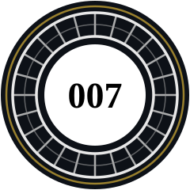

<div align="center">




[](https://github.com/Wawax007)


</div>

---

## 🗂️ MI6 PERSONNEL FILE — CLASSIFIED

```text
━━━━━━━━━━━━━━━━━━━━━━━━━━━━━━━━━━━━━━━━━━━━━━━━━━━━━━━━━
   TOP SECRET // FOR YOUR EYES ONLY // HANDLE VIA Q BRANCH
   PERSONNEL FILE #007-W                    [STAMP: MI6]
━━━━━━━━━━━━━━━━━━━━━━━━━━━━━━━━━━━━━━━━━━━━━━━━━━━━━━━━━
```

> **Codename:** Wawax007
> **Real name:** ███████ ██████
> **Location:** Grid ██-██, somewhere with good coffee
> **Status:** Active — last seen inside a hex editor at 3 AM
> **Cover identity:** Perfectly normal developer
> **Actual activity:** Opening game binaries "just to see how it works"
> **Threat level:** Directly proportional to remaining coffee supply ☕

The subject likes too many things and refuses to choose. Instead of picking one skill tree, he runs five in parallel and complains about respec costs:

| Clearance 🎩 | Official version | Field observations |
|---|---|---|
| 💻 **Dev** | Building software | 20% writing code, 80% renaming variables |
| 🧠 **AI** | Machine learning & LLMs | Politely asking matrices to hallucinate less |
| 🛡️ **Cyber** | Offensive & defensive security | "It's not a bug, it's an undocumented entry point" |
| 🔬 **Reverse** | Binary analysis | Ghidra, hexdumps, and an emotionally unhealthy relationship with XOR |
| 🎮 **Modding** | Extending games | Making games do things their devs never signed off on |

---

## 🎯 MISSION BRIEFING — Operation: First Light

```text
FROM: M                              TO: 007-W
SUBJECT: OPERATION FIRST LIGHT       CLEARANCE: ██████████
OBJECTIVE: Infiltrate the Glacier engine. Extract the formats.
           Leave no texture unturned.
```

Reverse-engineering and modding *007 First Light*: custom package formats, texture pipelines, font injection, full translation tooling.

Yes. An agent called **Wawax007** is dissecting a **007** game.
Nominative determinism is real, and it has a hex editor.

Other files on the desk:
- 🐱 **[MewgenicsRenamer](https://github.com/Wawax007/MewgenicsRenamer)** — rename every cat in Mewgenics, because power.
- 🎮 **[007-firstlight-toolkit](https://github.com/Wawax007/007-firstlight-toolkit)** — the full modding toolkit for *007 First Light*.
- 🧪 Various experiments that are *totally* going to be finished one day.

---

## 🍸 EQUIPMENT ISSUED BY Q BRANCH

*"Do try to bring the stack back in one piece, 007."*

<div align="center">


</div>

```python
class Wawax007:
    def __init__(self):
        self.hats = ["dev", "ai", "cyber", "reverse", "modding"]
        self.current_hat = random.choice(self.hats)  # changes hourly

    def fix_bug(self):
        while True:
            bug = self.find_bug()
            if bug.origin == "me, three commits ago":
                self.pretend_not_to_notice()
            else:
                break  # never reached
```

---

## 📊 FIELD REPORT — what M sees

<div align="center">


</div>

### 🐍 Asset SNK-007 consuming the evidence

<div align="center">

<picture>
  <source media="(prefers-color-scheme: dark)" srcset="https://raw.githubusercontent.com/Wawax007/Wawax007/output/github-snake-dark.svg">
  
</picture>

*The snake is eating my contributions. Don't worry — it has clearance.*

</div>

---

## ❓ INTERROGATION TRANSCRIPT

**Q: Dev, AI, cyber, reverse, modding… can you actually focus on one thing?**
A: No. Next question.

**Q: Why reverse-engineer a game instead of just playing it?**
A: Some people finish games. I finish *file formats*.

**Q: Is that legal?**
A: I mod my own games and hack with authorization. The only thing I attack without permission is my sleep schedule.

**Q: What's your favorite encryption?**
A: XOR with a hardcoded key. Not because it's good — because it keeps giving me work.

**Q: Shaken or stirred?**
A: `sudo`-ed.

---

<div align="center">

*This README will self-destruct in 5 seconds.*

*...*

*It won't. It's markdown. But it sounded cool.*

<br/>

### 🍸 WAWAX007 WILL RETURN
#### *(in his next commit)*


</div>
